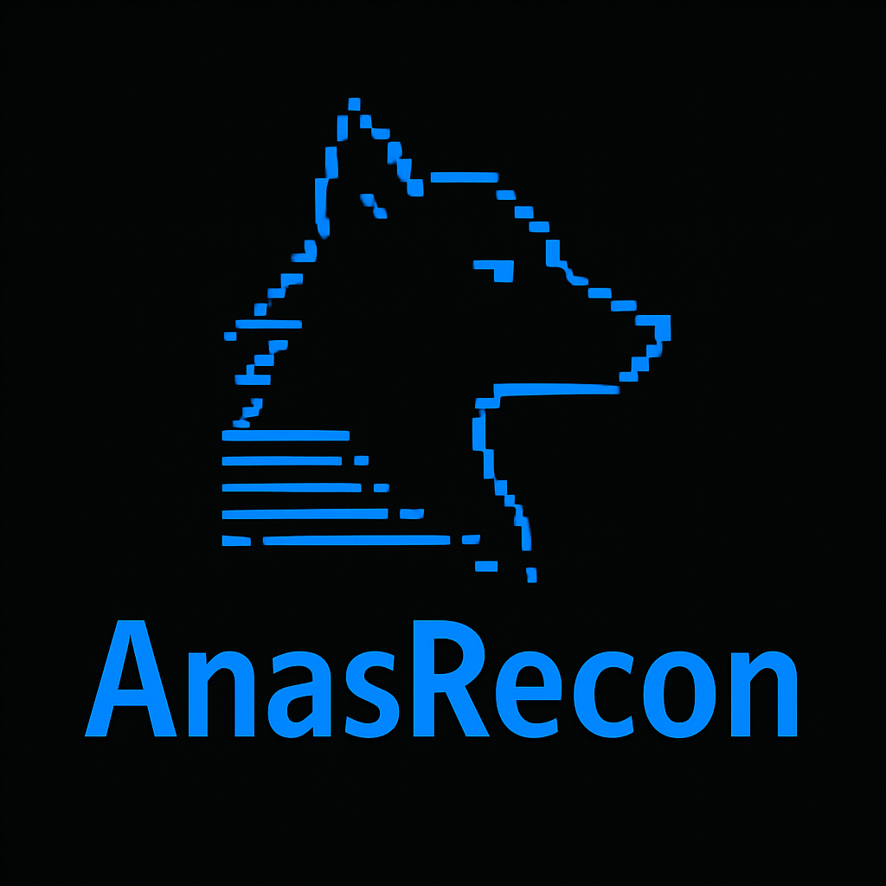

# 🕵️‍♂️ AnasRecon - Advanced Website Reconnaissance Tool



**AnasRecon** is a professional and powerful Python-based tool for deep website reconnaissance and information gathering. Designed for penetration testers, red teams, and cybersecurity analysts, it performs extensive scanning to identify technologies, vulnerabilities, and potential security misconfigurations.
❤ by [anasslabrini](https://github.com/anasslabrini).
MyWebSite: [anaslabrini](https://anaslabrini.netlify.app)

---

## 📦 Requirements

Before using AnasRecon, make sure your system meets the following requirements:

### 🧰 System Requirements

- Python 3.8 or higher
- `pip` package manager

### 📚 Python Dependencies

Install all required Python libraries with:

```bash
pip install -r requirements.txt
```

`requirements.txt` content:

```
requests
beautifulsoup4
tqdm
python-whois
pyOpenSSL
shodan
```

### 🛠 External Tools

Make sure `nmap` is installed on your system:

```bash
sudo apt install nmap
```

---

## 🚀 How to Run

Launch the tool using:

```bash
python3 anasrecon.py
```

You’ll be prompted to enter a target domain. Once entered, the tool will perform comprehensive reconnaissance and automatically save a detailed report inside the `recon_results/` directory.

---

## 🔍 Key Features

- 🌐 Extract domain and IP address
- 🧾 WHOIS lookup
- 🛰️ IP and ASN details via IPInfo
- 📡 Subdomain enumeration
- 🔐 SSL certificate inspection and cipher details
- 📥 HTTP headers analysis (security headers detection)
- 🧪 Sensitive keyword search (e.g., `password`, `token`, `admin`, `secret`)
- 🔍 Port scanning and service enumeration using Nmap
- ⚠️ Web vulnerability checks (XSS, SQLi, CSRF)
- 🔥 Risk level assessment (High / Medium / Low)
- 📊 Optional Shodan integration for deeper host analysis

---

## 📄 Output Example

Each scan generates a detailed `.txt` report:

```
recon_results/
└── example.com.txt
```

The report includes:

- Basic domain/IP information
- WHOIS & IPInfo data
- Subdomains list
- SSL details
- HTTP headers
- Sensitive keywords
- Web vulnerability results
- Nmap open ports & services
- Shodan data (optional)
- Final security risk score

---

## 👨‍💻 Author

**AnasRecon** was developed by **Anas Labrini** for Cybersecurity and aims to provide cybersecurity teams and information security experts with reliable and in-depth intelligence during the reconnaissance and initial assessment phases.

---

## ⚠️ Legal Disclaimer

> This tool is intended for educational purposes and certified security testing **only**. Unauthorized use of domains or systems without express permission is strictly prohibited. **Anas Labrini** is not responsible for any misuse or illegal activity related to this tool.
